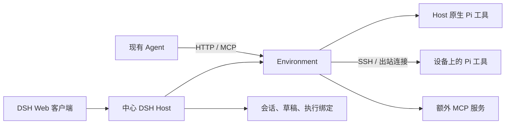

# 架构

Environment 持有机器、工作区和工具连接。Agent 持有推理、对话和自身工具。两者通过明确的目标编号协作，因此一个工作环境既能被中心化的 DSH 使用，也能被其他机器上的 Agent 使用。

## 执行位置

`environment.mjs` 维护稳定的资源编号，连接和在线状态随时间变化。`cloud` 代表运行服务的主机，SSH 工作区编号结合机器身份与规范化路径生成。一次 Environment 调用始终给出目标；不同 Agent 之间没有隐式共享的当前工作区。

`worker.mjs` 从上游 Pi 工厂构造七个工具，暴露为 MCP。`gateway.py` 和 `workspace_gateway.py` 通过 SSH 安装工具并转发调用；设备安装器还提供出站桥接。工具在目标用户权限下执行，相对路径从对应工作区起算。

## 服务入口

`environment-server.mjs` 直接运行 Environment 和 `environment-access.mjs`，无需模型或 DSH。`agent_environment.py` 初始化私有运行时并组织启动、诊断、服务配置和设备资源准备。

DSH 模式由 `dsh-product/plugin/host.mjs` 持有同一类 Environment，HTTP/MCP 入口复用 Host 已有的实例。外部 Agent 的资源调用保持 DSH 会话绑定、输入权和草稿。独立服务与 DSH 使用同一状态锁，同一个注册表只由一个 Host 进程写入。

HTTP 协议提供 `list`、`context`、`workspace`、`call`。标准 Streamable HTTP MCP 对外提供一个 `environment` 工具，参数使用同一套结构。协议、原生工具定义和项目上下文可通过入口发现。

## 会话接力

DSH 的会话事件保存当前机器、目录、绑定版本和输入权。工作区切换先确认目标目录可用，再提交新的绑定。运行中提出的切换会等当前轮结束。下一次模型请求刷新工作区身份、项目指令和 Git 摘要；历史文件和图片引用保留来源。

同一会话允许多个查看窗口，输入权属于一个窗口。接管输入和切换执行位置属于可检查的状态变化。其他 Agent 使用 Environment 时沿用自己的会话，只通过实际文件、进程和外部服务与 DSH 发生互动。

## 失败处理

请求取消只影响当前调用，共享连接保持其他会话的操作。连接恢复后会重新核对目标身份；超时、断线或部分失败不会自动重放写入和命令。HTTP 错误中的 `execution` 字段区分尚未开始与可能已执行，客户端据此先核对真实目标状态。

DSH 集成由 Host/Web 插件和固定版本的安装后补丁组成。升级上游需要重新验证补丁锚点、文件路由、会话事件、输入权和侧栏。版本检查会在不支持的构建上停止安装。
